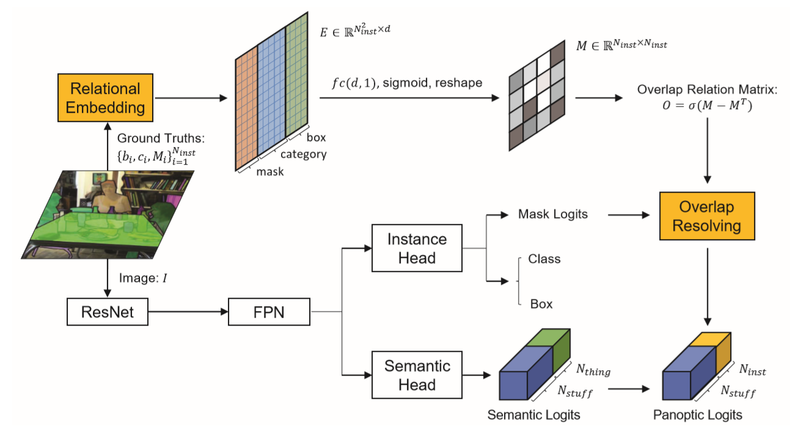

# Attention!!!
We have made the [detectron2-based code](https://github.com/LaoYang1994/SOGNet-Dev) public. But there are still some bugs in it. We will fix them as soon as possible.

# SOGNet
This repository is for [SOGNet: Scene Overlap Graph Network for Panoptic Segmentation](https://arxiv.org/abs/1911.07527) which has been accepted by AAAI2020 and won the Innovation Award in COCO 2019 challenge,

by [Yibo Yang](https://zero-lab-pku.github.io/personwise/yangyibo/), [Hongyang Li](https://zero-lab-pku.github.io/personwise/lihongyang/), [Xia Li](https://zero-lab-pku.github.io/personwise/lixia/), Qijie Zhao, [Jianlong Wu](https://zero-lab-pku.github.io/personwise/wujianlong/), [Zhouchen Lin](https://zero-lab-pku.github.io/personwise/linzhouchen/)

This repo is modified from [UPSNet](https://github.com/uber-research/UPSNet). We have been transfering the code into [detectron2](https://github.com/facebookresearch/detectron2) framework. Not finished yet.

## Introduction
The panoptic segmentation task requires a unified result from semantic and instance segmentation outputs that may contain overlaps. However, current studies widely ignore modeling overlaps. In this study, we aim to model overlap relations among instances and resolve them for panoptic segmentation. Inspired by scene graph representation, we formulate the overlapping problem as a simplified case, named scene overlap graph. We leverage each object's category, geometry and appearance features to perform relational embedding, and output a relation matrix that encodes overlap relations. In order to overcome the lack of supervision, we introduce a differentiable module to resolve the overlap between any pair of instances. The mask logits after removing overlaps are fed into per-pixel instance id classification, which leverages the panoptic supervision to assist in the modeling of overlap relations. Besides, we generate an approximate ground truth of overlap relations as the weak supervision, to quantify the accuracy of overlap relations predicted by our method. Experiments on COCO and Cityscapes demonstrate that our method is able to accurately predict overlap relations, and outperform the state-of-the-art performance for panoptic segmentation. Our method also won the Innovation Award in COCO 2019 challenge.



## Usage
+ Pytorch1.0 or above and Python 3 are needed.
+ Run ```init.sh ```first  for getting the pretrained models and panopticapi and compiling the project.
+ Run ```init_coco.sh``` for generating the ground truth file. Note that we use the panoptic annotation for our panoptic head, which is different from UPSNet.

**Train**
```bash
python tools/train_net.py --cfg PATH_TO_CONFIG_FILE.yaml
```

**Test**
```bash
python tools/test_net.py --cfg PATH_TO_CONFIG_FILE.yaml --weight_path PATH_TO_CHECKPOINT.pth
```
We provide our best model based on resnet50, you can download [here](https://drive.google.com/open?id=1Lc3ru2pigkA3ymYZPRfopxgnMMBxOZ1j).

|         |**test split**|**PQ**|**SQ**|**RQ**|**PQ_th**|**PQ_st**|
|---------|--------------|------|------|------|---------|---------|
|SOGNet-50|      val     | 43.7 | 78.7 | 53.5 |  50.6   |   33.1  |


## TODO
- [ ] Reimplement the code in detectron2. 

## Citation
If you find SOGNet useful in your research, please consider citing:
```latex
@article{yang19,
 author={Yibo Yang, Hongyang Li, Xia Li, Qijie Zhao, Jianlong Wu, Zhouchen Lin},
 title={SOGNet: Scene Overlap Graph Network for Panoptic Segmentation},
 journaltitle = {{arXiv}:1911.07527 [cs]},
 year={2019}
}
```
 
